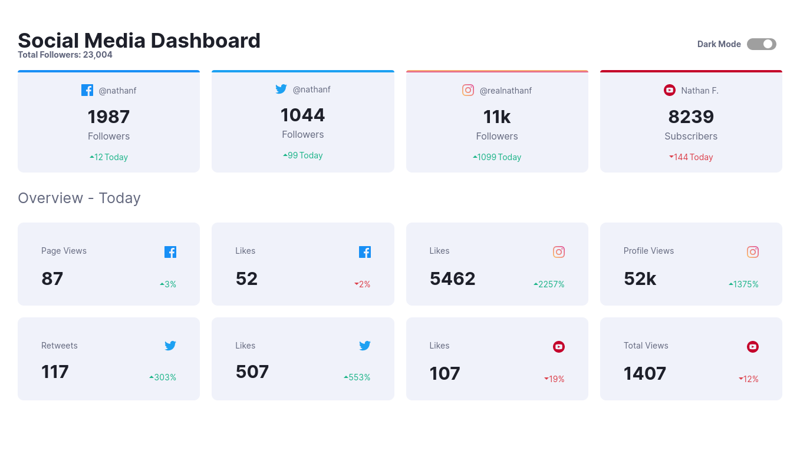

# Frontend Mentor - Social media dashboard with theme switcher solution

This is a solution to the [Social media dashboard with theme switcher challenge on Frontend Mentor](https://www.frontendmentor.io/challenges/social-media-dashboard-with-theme-switcher-6oY8ozp_H). Frontend Mentor challenges help you improve your coding skills by building realistic projects. 

## Table of contents

- [Overview](#overview)
  - [Live Demo](#live-demo)
  - [The challenge](#the-challenge)
  - [Built with](#built-with)
- [Getting Started](#getting-started)
  - [Prerequisites](#prerequisites)
  - [Setup](#setup)
  - [Usage](#usage)

- [Author](#author)
- [Acknowledgments](#acknowledgments)

## Overview

### Live Demo
Please check [live demo of the project.](https://social-dashboard.ozovalihasan.com/)

### The challenge

Users should be able to:

- View the optimal layout for the site depending on their device's screen size
- Toggle color theme to their preference

### Built with

- CSS custom properties
- Flexbox
- CSS Grid
- Mobile-first workflow
- [React](https://reactjs.org/) - JS library
- [Styled Components](https://styled-components.com/) - For styles

## Getting Started

To get a local copy up and running follow these simple example steps.

### Prerequisites

Make sure Node.js is running on your local machine.

### Setup

- Clone this repository
- Open terminal
- Change directory by using `cd social-media-dashboard`
- Run `npm install`

### Usage

- Run `npm start`
- Open a browser and go to http://localhost:3000

## Authors

Reach out to me at one of the following places!

👤 **Hasan Özovalı**

- Website: [ozovalihasan.com](https://ozovalihasan.com/)
- LinkedIn: [Hasan Özovalı](https://www.linkedin.com/in/hasan-ozovali/)
- Github: [@ozovalihasan](https://github.com/ozovalihasan)
- Twitter: [@ozovalihasan](https://twitter.com/ozovalihasan)
- Mail: [ozovalihasan@gmail.com](mailto:ozovalihasan@gmail.com)

## Acknowledgments

- [Frontend Mentor](frontendmentor.io/)

